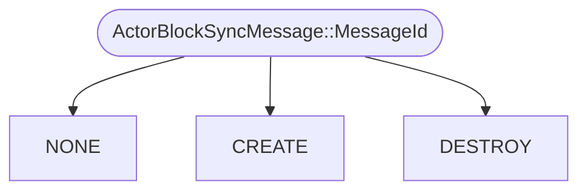

# ActorBlockSyncMessage::MessageId

`enum` - wire `uint32`

```mermaid
flowchart TB
  ROOT(["ActorBlockSyncMessage::MessageId"])
  ROOT --> NONE["NONE"]
  ROOT --> CREATE["CREATE"]
  ROOT --> DESTROY["DESTROY"]
```

