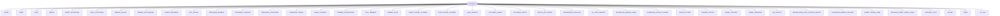

# ActorEvent

`enum` - wire `uint8`

```mermaid
flowchart TB
  ROOT(["ActorEvent"])
  ROOT --> NONE["NONE"]
  ROOT --> JUMP["JUMP"]
  ROOT --> HURT["HURT"]
  ROOT --> DEATH["DEATH"]
  ROOT --> START_ATTACKING["START_ATTACKING"]
  ROOT --> STOP_ATTACKING["STOP_ATTACKING"]
  ROOT --> TAMING_FAILED["TAMING_FAILED"]
  ROOT --> TAMING_SUCCEEDED["TAMING_SUCCEEDED"]
  ROOT --> SHAKE_WETNESS["SHAKE_WETNESS"]
  ROOT --> EAT_GRASS["EAT_GRASS"]
  ROOT --> FISHHOOK_BUBBLE["FISHHOOK_BUBBLE"]
  ROOT --> FISHHOOK_FISHPOS["FISHHOOK_FISHPOS"]
  ROOT --> FISHHOOK_HOOKTIME["FISHHOOK_HOOKTIME"]
  ROOT --> FISHHOOK_TEASE["FISHHOOK_TEASE"]
  ROOT --> SQUID_FLEEING["SQUID_FLEEING"]
  ROOT --> ZOMBIE_CONVERTING["ZOMBIE_CONVERTING"]
  ROOT --> PLAY_AMBIENT["PLAY_AMBIENT"]
  ROOT --> SPAWN_ALIVE["SPAWN_ALIVE"]
  ROOT --> START_OFFER_FLOWER["START_OFFER_FLOWER"]
  ROOT --> STOP_OFFER_FLOWER["STOP_OFFER_FLOWER"]
  ROOT --> LOVE_HEARTS["LOVE_HEARTS"]
  ROOT --> VILLAGER_ANGRY["VILLAGER_ANGRY"]
  ROOT --> VILLAGER_HAPPY["VILLAGER_HAPPY"]
  ROOT --> WITCH_HAT_MAGIC["WITCH_HAT_MAGIC"]
  ROOT --> FIREWORKS_EXPLODE["FIREWORKS_EXPLODE"]
  ROOT --> IN_LOVE_HEARTS["IN_LOVE_HEARTS"]
  ROOT --> SILVERFISH_MERGE_ANIM["SILVERFISH_MERGE_ANIM"]
  ROOT --> GUARDIAN_ATTACK_SOUND["GUARDIAN_ATTACK_SOUND"]
  ROOT --> DRINK_POTION["DRINK_POTION"]
  ROOT --> THROW_POTION["THROW_POTION"]
  ROOT --> PRIME_TNTCART["PRIME_TNTCART"]
  ROOT --> PRIME_CREEPER["PRIME_CREEPER"]
  ROOT --> AIR_SUPPLY["AIR_SUPPLY"]
  ROOT --> DEPRECATED_ADD_PLAYER_LEVELS["DEPRECATED_ADD_PLAYER_LEVELS"]
  ROOT --> GUARDIAN_MINING_FATIGUE["GUARDIAN_MINING_FATIGUE"]
  ROOT --> AGENT_SWING_ARM["AGENT_SWING_ARM"]
  ROOT --> DRAGON_START_DEATH_ANIM["DRAGON_START_DEATH_ANIM"]
  ROOT --> GROUND_DUST["GROUND_DUST"]
  ROOT --> SHAKE["SHAKE"]
  ROOT --> FEED["FEED"]
  ROOT --> more["... 21 more"]
```

