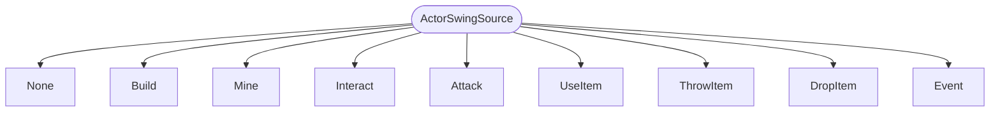

# ActorSwingSource

`enum` - wire `uint8`

```mermaid
flowchart TB
  ROOT(["ActorSwingSource"])
  ROOT --> None["None"]
  ROOT --> Build["Build"]
  ROOT --> Mine["Mine"]
  ROOT --> Interact["Interact"]
  ROOT --> Attack["Attack"]
  ROOT --> UseItem["UseItem"]
  ROOT --> ThrowItem["ThrowItem"]
  ROOT --> DropItem["DropItem"]
  ROOT --> Event["Event"]
```

