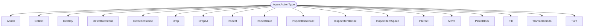

# AgentActionType

`enum` - wire `int32`

```mermaid
flowchart TB
  ROOT(["AgentActionType"])
  ROOT --> Attack["Attack"]
  ROOT --> Collect["Collect"]
  ROOT --> Destroy["Destroy"]
  ROOT --> DetectRedstone["DetectRedstone"]
  ROOT --> DetectObstacle["DetectObstacle"]
  ROOT --> Drop["Drop"]
  ROOT --> DropAll["DropAll"]
  ROOT --> Inspect["Inspect"]
  ROOT --> InspectData["InspectData"]
  ROOT --> InspectItemCount["InspectItemCount"]
  ROOT --> InspectItemDetail["InspectItemDetail"]
  ROOT --> InspectItemSpace["InspectItemSpace"]
  ROOT --> Interact["Interact"]
  ROOT --> Move["Move"]
  ROOT --> PlaceBlock["PlaceBlock"]
  ROOT --> Till["Till"]
  ROOT --> TransferItemTo["TransferItemTo"]
  ROOT --> Turn["Turn"]
```

