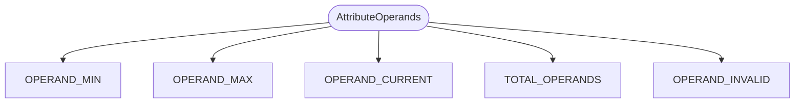

# AttributeOperands

`enum` - wire `int32`

```mermaid
flowchart TB
  ROOT(["AttributeOperands"])
  ROOT --> OPERAND_MIN["OPERAND_MIN"]
  ROOT --> OPERAND_MAX["OPERAND_MAX"]
  ROOT --> OPERAND_CURRENT["OPERAND_CURRENT"]
  ROOT --> TOTAL_OPERANDS["TOTAL_OPERANDS"]
  ROOT --> OPERAND_INVALID["OPERAND_INVALID"]
```

