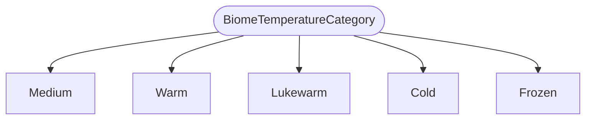

# BiomeTemperatureCategory

`enum` - wire `uint8`

```mermaid
flowchart TB
  ROOT(["BiomeTemperatureCategory"])
  ROOT --> Medium["Medium"]
  ROOT --> Warm["Warm"]
  ROOT --> Lukewarm["Lukewarm"]
  ROOT --> Cold["Cold"]
  ROOT --> Frozen["Frozen"]
```

