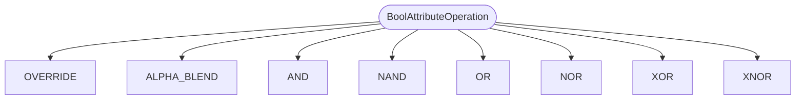

# BoolAttributeOperation

`enum` - wire `int32`

```mermaid
flowchart TB
  ROOT(["BoolAttributeOperation"])
  ROOT --> OVERRIDE["OVERRIDE"]
  ROOT --> ALPHA_BLEND["ALPHA_BLEND"]
  ROOT --> AND["AND"]
  ROOT --> NAND["NAND"]
  ROOT --> OR["OR"]
  ROOT --> NOR["NOR"]
  ROOT --> XOR["XOR"]
  ROOT --> XNOR["XNOR"]
```

