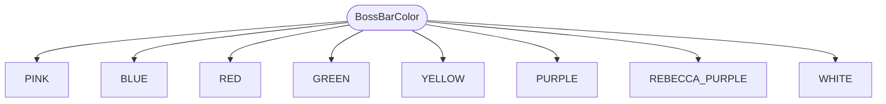

# BossBarColor

`enum` - wire `uint8`

```mermaid
flowchart TB
  ROOT(["BossBarColor"])
  ROOT --> PINK["PINK"]
  ROOT --> BLUE["BLUE"]
  ROOT --> RED["RED"]
  ROOT --> GREEN["GREEN"]
  ROOT --> YELLOW["YELLOW"]
  ROOT --> PURPLE["PURPLE"]
  ROOT --> REBECCA_PURPLE["REBECCA_PURPLE"]
  ROOT --> WHITE["WHITE"]
```

