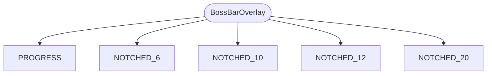

# BossBarOverlay

`enum` - wire `uint8`

```mermaid
flowchart TB
  ROOT(["BossBarOverlay"])
  ROOT --> PROGRESS["PROGRESS"]
  ROOT --> NOTCHED_6["NOTCHED_6"]
  ROOT --> NOTCHED_10["NOTCHED_10"]
  ROOT --> NOTCHED_12["NOTCHED_12"]
  ROOT --> NOTCHED_20["NOTCHED_20"]
```

