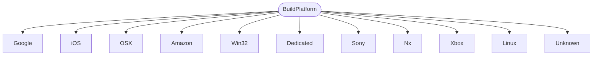

# BuildPlatform

`enum` - wire `int32`

```mermaid
flowchart TB
  ROOT(["BuildPlatform"])
  ROOT --> Google["Google"]
  ROOT --> iOS["iOS"]
  ROOT --> OSX["OSX"]
  ROOT --> Amazon["Amazon"]
  ROOT --> Win32["Win32"]
  ROOT --> Dedicated["Dedicated"]
  ROOT --> Sony["Sony"]
  ROOT --> Nx["Nx"]
  ROOT --> Xbox["Xbox"]
  ROOT --> Linux["Linux"]
  ROOT --> Unknown["Unknown"]
```

