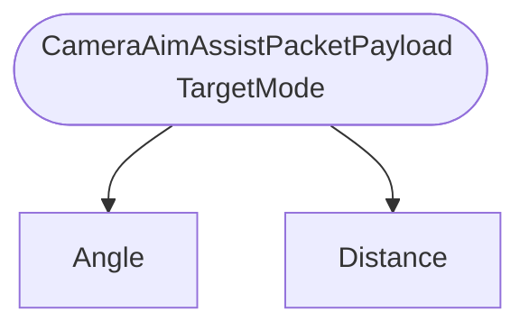

# CameraAimAssistPacketPayload TargetMode

`enum` - wire `uint8`

```mermaid
flowchart TB
  ROOT(["CameraAimAssistPacketPayload TargetMode"])
  ROOT --> Angle["Angle"]
  ROOT --> Distance["Distance"]
```

