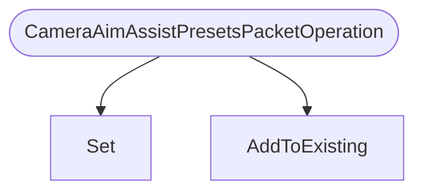

# CameraAimAssistPresetsPacketOperation

`enum` - wire `uint8`

```mermaid
flowchart TB
  ROOT(["CameraAimAssistPresetsPacketOperation"])
  ROOT --> Set["Set"]
  ROOT --> AddToExisting["AddToExisting"]
```

