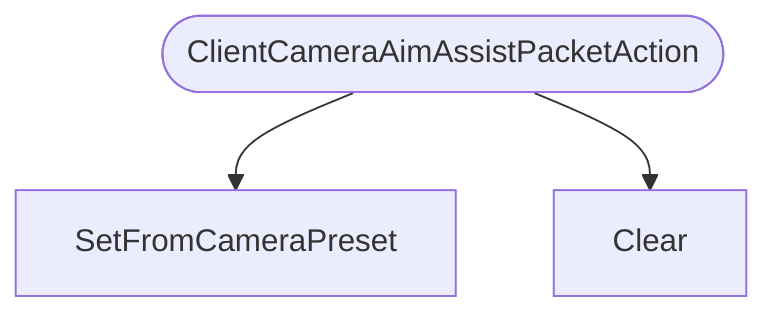

# ClientCameraAimAssistPacketAction

`enum` - wire `uint8`

```mermaid
flowchart TB
  ROOT(["ClientCameraAimAssistPacketAction"])
  ROOT --> SetFromCameraPreset["SetFromCameraPreset"]
  ROOT --> Clear["Clear"]
```

