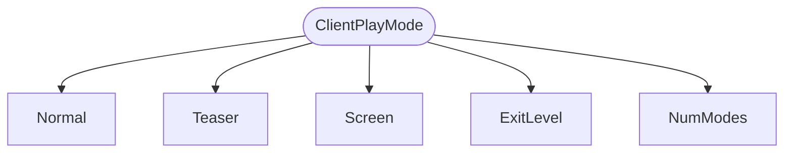

# ClientPlayMode

`enum` - wire `uint32`

```mermaid
flowchart TB
  ROOT(["ClientPlayMode"])
  ROOT --> Normal["Normal"]
  ROOT --> Teaser["Teaser"]
  ROOT --> Screen["Screen"]
  ROOT --> ExitLevel["ExitLevel"]
  ROOT --> NumModes["NumModes"]
```

