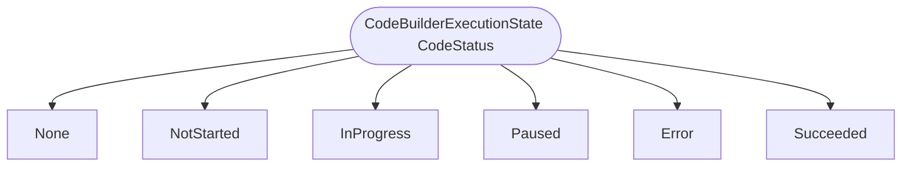

# CodeBuilderExecutionState CodeStatus

`enum` - wire `uint8`

```mermaid
flowchart TB
  ROOT(["CodeBuilderExecutionState CodeStatus"])
  ROOT --> None["None"]
  ROOT --> NotStarted["NotStarted"]
  ROOT --> InProgress["InProgress"]
  ROOT --> Paused["Paused"]
  ROOT --> Error["Error"]
  ROOT --> Succeeded["Succeeded"]
```

