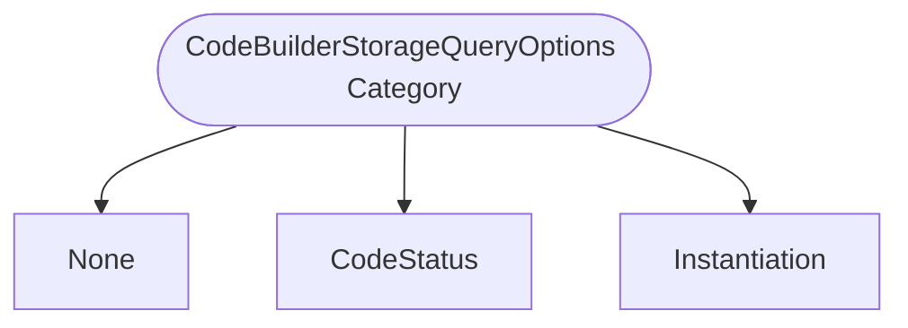

# CodeBuilderStorageQueryOptions Category

`enum` - wire `uint8`

```mermaid
flowchart TB
  ROOT(["CodeBuilderStorageQueryOptions Category"])
  ROOT --> None["None"]
  ROOT --> CodeStatus["CodeStatus"]
  ROOT --> Instantiation["Instantiation"]
```

