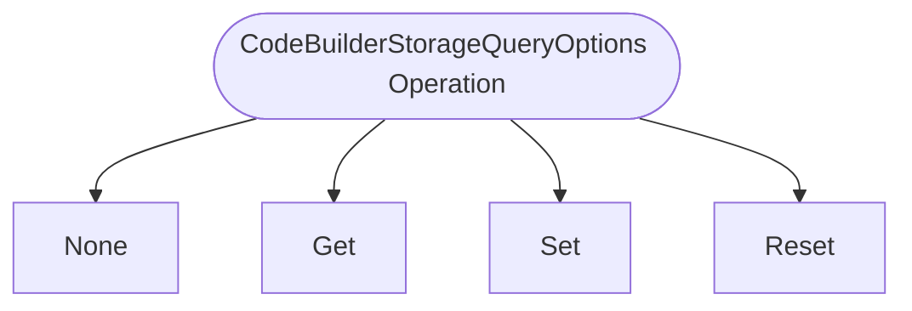

# CodeBuilderStorageQueryOptions Operation

`enum` - wire `uint8`

```mermaid
flowchart TB
  ROOT(["CodeBuilderStorageQueryOptions Operation"])
  ROOT --> None["None"]
  ROOT --> Get["Get"]
  ROOT --> Set["Set"]
  ROOT --> Reset["Reset"]
```

