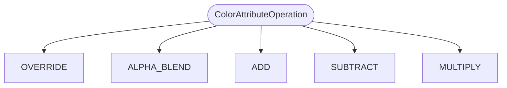

# ColorAttributeOperation

`enum` - wire `int32`

```mermaid
flowchart TB
  ROOT(["ColorAttributeOperation"])
  ROOT --> OVERRIDE["OVERRIDE"]
  ROOT --> ALPHA_BLEND["ALPHA_BLEND"]
  ROOT --> ADD["ADD"]
  ROOT --> SUBTRACT["SUBTRACT"]
  ROOT --> MULTIPLY["MULTIPLY"]
```

