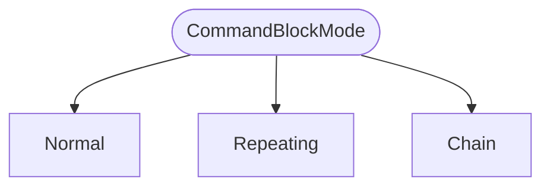

# CommandBlockMode

`enum` - wire `uint16`

- protocol: 2168
- minecraft: 1.26.40

```mermaid
flowchart TB
  ROOT(["CommandBlockMode"])
  ROOT --> Normal["Normal"]
  ROOT --> Repeating["Repeating"]
  ROOT --> Chain["Chain"]
```

