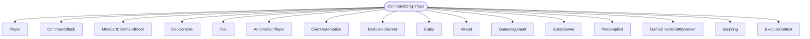

# CommandOriginType

`enum` - wire `uint8`

```mermaid
flowchart TB
  ROOT(["CommandOriginType"])
  ROOT --> Player["Player"]
  ROOT --> CommandBlock["CommandBlock"]
  ROOT --> MinecartCommandBlock["MinecartCommandBlock"]
  ROOT --> DevConsole["DevConsole"]
  ROOT --> Test["Test"]
  ROOT --> AutomationPlayer["AutomationPlayer"]
  ROOT --> ClientAutomation["ClientAutomation"]
  ROOT --> DedicatedServer["DedicatedServer"]
  ROOT --> Entity["Entity"]
  ROOT --> Virtual["Virtual"]
  ROOT --> GameArgument["GameArgument"]
  ROOT --> EntityServer["EntityServer"]
  ROOT --> Precompiled["Precompiled"]
  ROOT --> GameDirectorEntityServer["GameDirectorEntityServer"]
  ROOT --> Scripting["Scripting"]
  ROOT --> ExecuteContext["ExecuteContext"]
```

