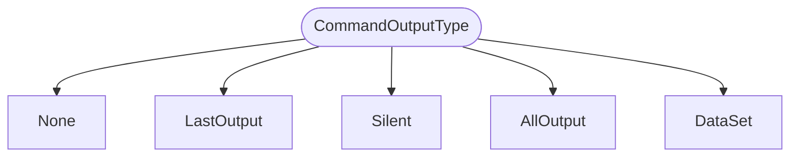

# CommandOutputType

`enum` - wire `int32`

```mermaid
flowchart TB
  ROOT(["CommandOutputType"])
  ROOT --> None["None"]
  ROOT --> LastOutput["LastOutput"]
  ROOT --> Silent["Silent"]
  ROOT --> AllOutput["AllOutput"]
  ROOT --> DataSet["DataSet"]
```

