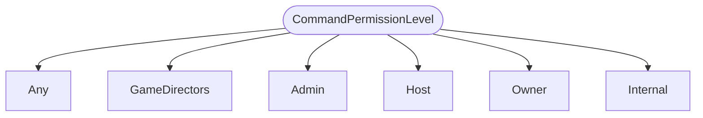

# CommandPermissionLevel

`enum` - wire `uint8`

```mermaid
flowchart TB
  ROOT(["CommandPermissionLevel"])
  ROOT --> Any["Any"]
  ROOT --> GameDirectors["GameDirectors"]
  ROOT --> Admin["Admin"]
  ROOT --> Host["Host"]
  ROOT --> Owner["Owner"]
  ROOT --> Internal["Internal"]
```

