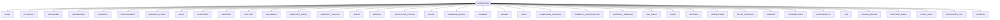

# ContainerType

`enum` - wire `int8`

- protocol: 2168
- minecraft: 1.26.40

```mermaid
flowchart TB
  ROOT(["ContainerType"])
  ROOT --> NONE["NONE"]
  ROOT --> INVENTORY["INVENTORY"]
  ROOT --> CONTAINER["CONTAINER"]
  ROOT --> WORKBENCH["WORKBENCH"]
  ROOT --> FURNACE["FURNACE"]
  ROOT --> ENCHANTMENT["ENCHANTMENT"]
  ROOT --> BREWING_STAND["BREWING_STAND"]
  ROOT --> ANVIL["ANVIL"]
  ROOT --> DISPENSER["DISPENSER"]
  ROOT --> DROPPER["DROPPER"]
  ROOT --> HOPPER["HOPPER"]
  ROOT --> CAULDRON["CAULDRON"]
  ROOT --> MINECART_CHEST["MINECART_CHEST"]
  ROOT --> MINECART_HOPPER["MINECART_HOPPER"]
  ROOT --> HORSE["HORSE"]
  ROOT --> BEACON["BEACON"]
  ROOT --> STRUCTURE_EDITOR["STRUCTURE_EDITOR"]
  ROOT --> TRADE["TRADE"]
  ROOT --> COMMAND_BLOCK["COMMAND_BLOCK"]
  ROOT --> JUKEBOX["JUKEBOX"]
  ROOT --> ARMOR["ARMOR"]
  ROOT --> HAND["HAND"]
  ROOT --> COMPOUND_CREATOR["COMPOUND_CREATOR"]
  ROOT --> ELEMENT_CONSTRUCTOR["ELEMENT_CONSTRUCTOR"]
  ROOT --> MATERIAL_REDUCER["MATERIAL_REDUCER"]
  ROOT --> LAB_TABLE["LAB_TABLE"]
  ROOT --> LOOM["LOOM"]
  ROOT --> LECTERN["LECTERN"]
  ROOT --> GRINDSTONE["GRINDSTONE"]
  ROOT --> BLAST_FURNACE["BLAST_FURNACE"]
  ROOT --> SMOKER["SMOKER"]
  ROOT --> STONECUTTER["STONECUTTER"]
  ROOT --> CARTOGRAPHY["CARTOGRAPHY"]
  ROOT --> HUD["HUD"]
  ROOT --> JIGSAW_EDITOR["JIGSAW_EDITOR"]
  ROOT --> SMITHING_TABLE["SMITHING_TABLE"]
  ROOT --> CHEST_BOAT["CHEST_BOAT"]
  ROOT --> DECORATED_POT["DECORATED_POT"]
  ROOT --> CRAFTER["CRAFTER"]
```

