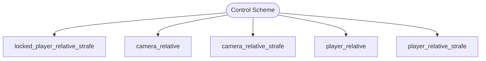

# Control Scheme

`enum` - wire `uint8`

```mermaid
flowchart TB
  ROOT(["Control Scheme"])
  ROOT --> locked_player_relative_strafe["locked_player_relative_strafe"]
  ROOT --> camera_relative["camera_relative"]
  ROOT --> camera_relative_strafe["camera_relative_strafe"]
  ROOT --> player_relative["player_relative"]
  ROOT --> player_relative_strafe["player_relative_strafe"]
```

