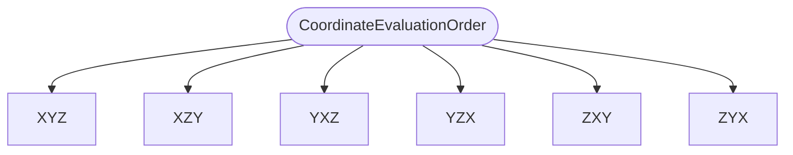

# CoordinateEvaluationOrder

`enum` - wire `int32`

```mermaid
flowchart TB
  ROOT(["CoordinateEvaluationOrder"])
  ROOT --> XYZ["XYZ"]
  ROOT --> XZY["XZY"]
  ROOT --> YXZ["YXZ"]
  ROOT --> YZX["YZX"]
  ROOT --> ZXY["ZXY"]
  ROOT --> ZYX["ZYX"]
```

