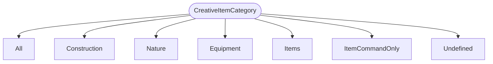

# CreativeItemCategory

`enum` - wire `uint8`

```mermaid
flowchart TB
  ROOT(["CreativeItemCategory"])
  ROOT --> All["All"]
  ROOT --> Construction["Construction"]
  ROOT --> Nature["Nature"]
  ROOT --> Equipment["Equipment"]
  ROOT --> Items["Items"]
  ROOT --> ItemCommandOnly["ItemCommandOnly"]
  ROOT --> Undefined["Undefined"]
```

