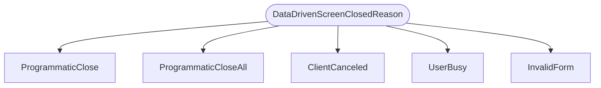

# DataDrivenScreenClosedReason

`enum` - wire `uint8`

- protocol: 2168
- minecraft: 1.26.40

```mermaid
flowchart TB
  ROOT(["DataDrivenScreenClosedReason"])
  ROOT --> ProgrammaticClose["ProgrammaticClose"]
  ROOT --> ProgrammaticCloseAll["ProgrammaticCloseAll"]
  ROOT --> ClientCanceled["ClientCanceled"]
  ROOT --> UserBusy["UserBusy"]
  ROOT --> InvalidForm["InvalidForm"]
```

