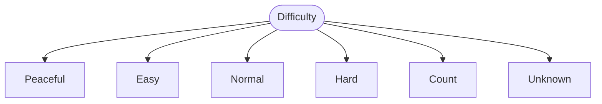

# Difficulty

`enum` - wire `int32`

```mermaid
flowchart TB
  ROOT(["Difficulty"])
  ROOT --> Peaceful["Peaceful"]
  ROOT --> Easy["Easy"]
  ROOT --> Normal["Normal"]
  ROOT --> Hard["Hard"]
  ROOT --> Count["Count"]
  ROOT --> Unknown["Unknown"]
```

