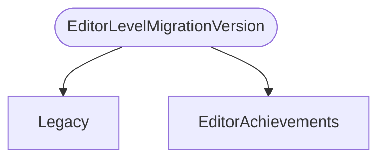

# EditorLevelMigrationVersion

`enum` - wire `int8`

```mermaid
flowchart TB
  ROOT(["EditorLevelMigrationVersion"])
  ROOT --> Legacy["Legacy"]
  ROOT --> EditorAchievements["EditorAchievements"]
```

