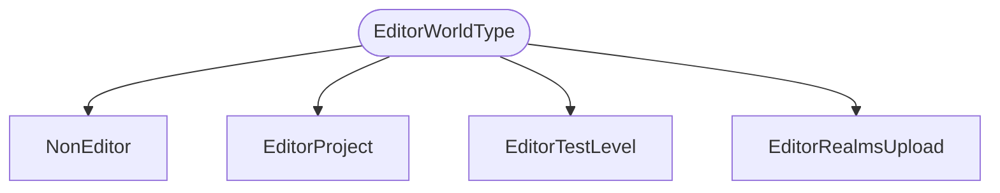

# EditorWorldType

`enum` - wire `int32`

```mermaid
flowchart TB
  ROOT(["EditorWorldType"])
  ROOT --> NonEditor["NonEditor"]
  ROOT --> EditorProject["EditorProject"]
  ROOT --> EditorTestLevel["EditorTestLevel"]
  ROOT --> EditorRealmsUpload["EditorRealmsUpload"]
```

