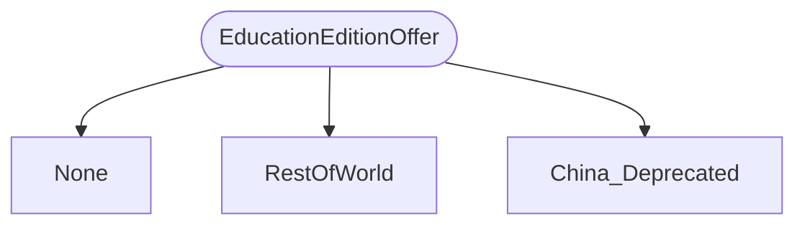

# EducationEditionOffer

`enum` - wire `uint32`

```mermaid
flowchart TB
  ROOT(["EducationEditionOffer"])
  ROOT --> None["None"]
  ROOT --> RestOfWorld["RestOfWorld"]
  ROOT --> China_Deprecated["China_Deprecated"]
```

