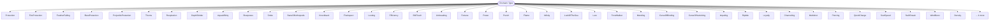

# Enchant::Type

`enum` - wire `uint8`

```mermaid
flowchart TB
  ROOT(["Enchant::Type"])
  ROOT --> Protection["Protection"]
  ROOT --> FireProtection["FireProtection"]
  ROOT --> FeatherFalling["FeatherFalling"]
  ROOT --> BlastProtection["BlastProtection"]
  ROOT --> ProjectileProtection["ProjectileProtection"]
  ROOT --> Thorns["Thorns"]
  ROOT --> Respiration["Respiration"]
  ROOT --> DepthStrider["DepthStrider"]
  ROOT --> AquaAffinity["AquaAffinity"]
  ROOT --> Sharpness["Sharpness"]
  ROOT --> Smite["Smite"]
  ROOT --> BaneOfArthropods["BaneOfArthropods"]
  ROOT --> Knockback["Knockback"]
  ROOT --> FireAspect["FireAspect"]
  ROOT --> Looting["Looting"]
  ROOT --> Efficiency["Efficiency"]
  ROOT --> SilkTouch["SilkTouch"]
  ROOT --> Unbreaking["Unbreaking"]
  ROOT --> Fortune["Fortune"]
  ROOT --> Power["Power"]
  ROOT --> Punch["Punch"]
  ROOT --> Flame["Flame"]
  ROOT --> Infinity["Infinity"]
  ROOT --> LuckOfTheSea["LuckOfTheSea"]
  ROOT --> Lure["Lure"]
  ROOT --> FrostWalker["FrostWalker"]
  ROOT --> Mending["Mending"]
  ROOT --> CurseOfBinding["CurseOfBinding"]
  ROOT --> CurseOfVanishing["CurseOfVanishing"]
  ROOT --> Impaling["Impaling"]
  ROOT --> Riptide["Riptide"]
  ROOT --> Loyalty["Loyalty"]
  ROOT --> Channeling["Channeling"]
  ROOT --> Multishot["Multishot"]
  ROOT --> Piercing["Piercing"]
  ROOT --> QuickCharge["QuickCharge"]
  ROOT --> SoulSpeed["SoulSpeed"]
  ROOT --> SwiftSneak["SwiftSneak"]
  ROOT --> WindBurst["WindBurst"]
  ROOT --> Density["Density"]
  ROOT --> more["... 4 more"]
```

