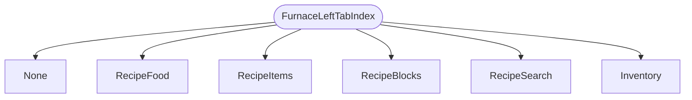

# FurnaceLeftTabIndex

`enum` - wire `int32`

```mermaid
flowchart TB
  ROOT(["FurnaceLeftTabIndex"])
  ROOT --> None["None"]
  ROOT --> RecipeFood["RecipeFood"]
  ROOT --> RecipeItems["RecipeItems"]
  ROOT --> RecipeBlocks["RecipeBlocks"]
  ROOT --> RecipeSearch["RecipeSearch"]
  ROOT --> Inventory["Inventory"]
```

