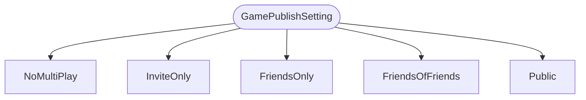

# GamePublishSetting

`enum` - wire `int32`

```mermaid
flowchart TB
  ROOT(["GamePublishSetting"])
  ROOT --> NoMultiPlay["NoMultiPlay"]
  ROOT --> InviteOnly["InviteOnly"]
  ROOT --> FriendsOnly["FriendsOnly"]
  ROOT --> FriendsOfFriends["FriendsOfFriends"]
  ROOT --> Public["Public"]
```

