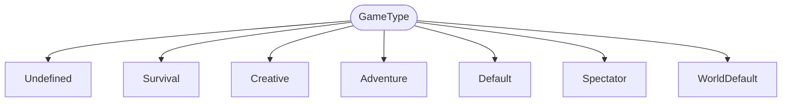

# GameType

`enum` - wire `int32`

```mermaid
flowchart TB
  ROOT(["GameType"])
  ROOT --> Undefined["Undefined"]
  ROOT --> Survival["Survival"]
  ROOT --> Creative["Creative"]
  ROOT --> Adventure["Adventure"]
  ROOT --> Default["Default"]
  ROOT --> Spectator["Spectator"]
  ROOT --> WorldDefault["WorldDefault"]
```

