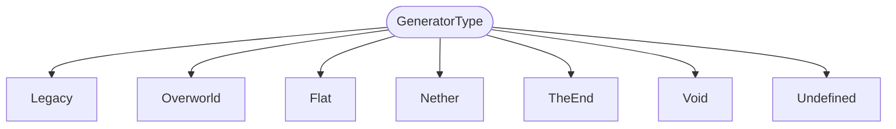

# GeneratorType

`enum` - wire `int32`

```mermaid
flowchart TB
  ROOT(["GeneratorType"])
  ROOT --> Legacy["Legacy"]
  ROOT --> Overworld["Overworld"]
  ROOT --> Flat["Flat"]
  ROOT --> Nether["Nether"]
  ROOT --> TheEnd["TheEnd"]
  ROOT --> Void["Void"]
  ROOT --> Undefined["Undefined"]
```

