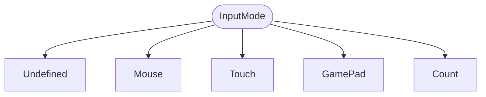

# InputMode

`enum` - wire `uint32`

```mermaid
flowchart TB
  ROOT(["InputMode"])
  ROOT --> Undefined["Undefined"]
  ROOT --> Mouse["Mouse"]
  ROOT --> Touch["Touch"]
  ROOT --> GamePad["GamePad"]
  ROOT --> Count["Count"]
```

