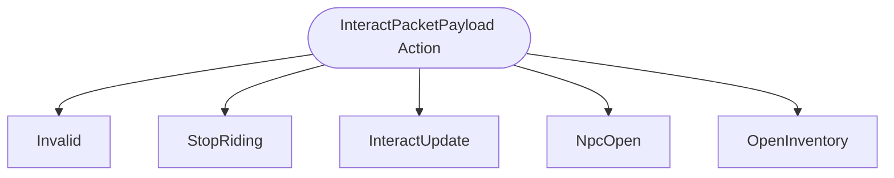

# InteractPacketPayload Action

`enum` - wire `uint8`

```mermaid
flowchart TB
  ROOT(["InteractPacketPayload Action"])
  ROOT --> Invalid["Invalid"]
  ROOT --> StopRiding["StopRiding"]
  ROOT --> InteractUpdate["InteractUpdate"]
  ROOT --> NpcOpen["NpcOpen"]
  ROOT --> OpenInventory["OpenInventory"]
```

