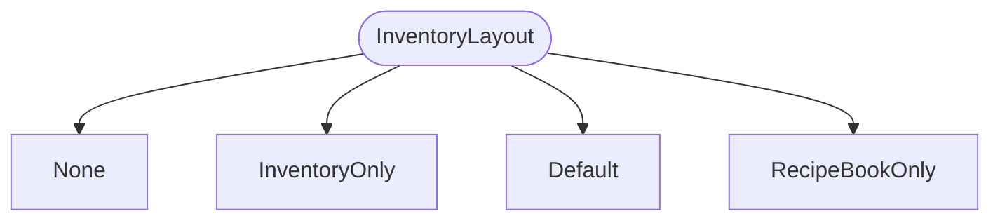

# InventoryLayout

`enum` - wire `int32`

```mermaid
flowchart TB
  ROOT(["InventoryLayout"])
  ROOT --> None["None"]
  ROOT --> InventoryOnly["InventoryOnly"]
  ROOT --> Default["Default"]
  ROOT --> RecipeBookOnly["RecipeBookOnly"]
```

