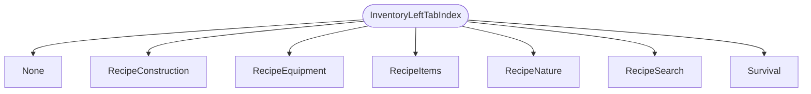

# InventoryLeftTabIndex

`enum` - wire `int32`

```mermaid
flowchart TB
  ROOT(["InventoryLeftTabIndex"])
  ROOT --> None["None"]
  ROOT --> RecipeConstruction["RecipeConstruction"]
  ROOT --> RecipeEquipment["RecipeEquipment"]
  ROOT --> RecipeItems["RecipeItems"]
  ROOT --> RecipeNature["RecipeNature"]
  ROOT --> RecipeSearch["RecipeSearch"]
  ROOT --> Survival["Survival"]
```

