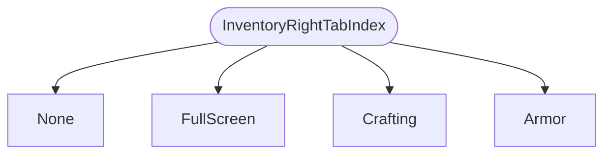

# InventoryRightTabIndex

`enum` - wire `int32`

```mermaid
flowchart TB
  ROOT(["InventoryRightTabIndex"])
  ROOT --> None["None"]
  ROOT --> FullScreen["FullScreen"]
  ROOT --> Crafting["Crafting"]
  ROOT --> Armor["Armor"]
```

