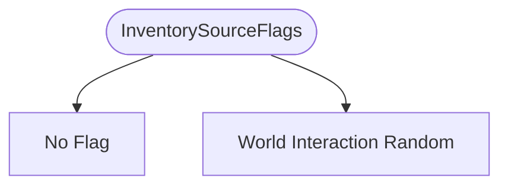

# InventorySourceFlags

`enum` - wire `uint32`

```mermaid
flowchart TB
  ROOT(["InventorySourceFlags"])
  ROOT --> No_Flag["No Flag"]
  ROOT --> World_Interaction_Random["World Interaction Random"]
```

