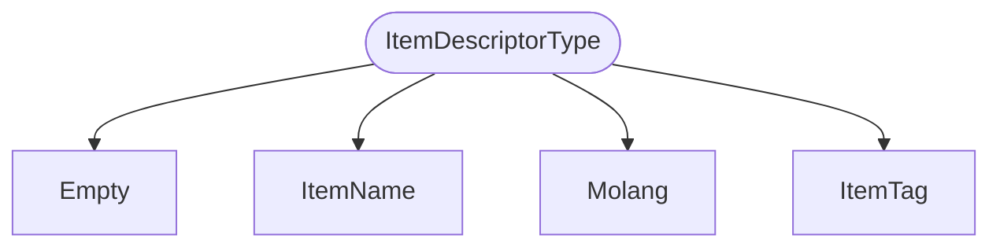

# ItemDescriptorType

`enum` - wire `uint8`

```mermaid
flowchart TB
  ROOT(["ItemDescriptorType"])
  ROOT --> Empty["Empty"]
  ROOT --> ItemName["ItemName"]
  ROOT --> Molang["Molang"]
  ROOT --> ItemTag["ItemTag"]
```

