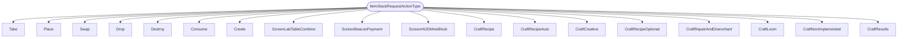

# ItemStackRequestActionType

`enum` - wire `uint8`

```mermaid
flowchart TB
  ROOT(["ItemStackRequestActionType"])
  ROOT --> Take["Take"]
  ROOT --> Place["Place"]
  ROOT --> Swap["Swap"]
  ROOT --> Drop["Drop"]
  ROOT --> Destroy["Destroy"]
  ROOT --> Consume["Consume"]
  ROOT --> Create["Create"]
  ROOT --> ScreenLabTableCombine["ScreenLabTableCombine"]
  ROOT --> ScreenBeaconPayment["ScreenBeaconPayment"]
  ROOT --> ScreenHUDMineBlock["ScreenHUDMineBlock"]
  ROOT --> CraftRecipe["CraftRecipe"]
  ROOT --> CraftRecipeAuto["CraftRecipeAuto"]
  ROOT --> CraftCreative["CraftCreative"]
  ROOT --> CraftRecipeOptional["CraftRecipeOptional"]
  ROOT --> CraftRepairAndDisenchant["CraftRepairAndDisenchant"]
  ROOT --> CraftLoom["CraftLoom"]
  ROOT --> CraftNonImplemented["CraftNonImplemented"]
  ROOT --> CraftResults["CraftResults"]
```

