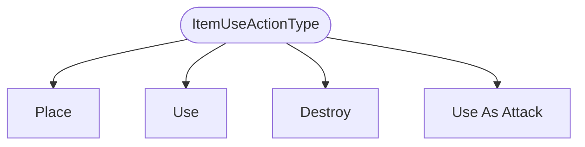

# ItemUseActionType

`enum` - wire `int32`

```mermaid
flowchart TB
  ROOT(["ItemUseActionType"])
  ROOT --> Place["Place"]
  ROOT --> Use["Use"]
  ROOT --> Destroy["Destroy"]
  ROOT --> Use_As_Attack["Use As Attack"]
```

