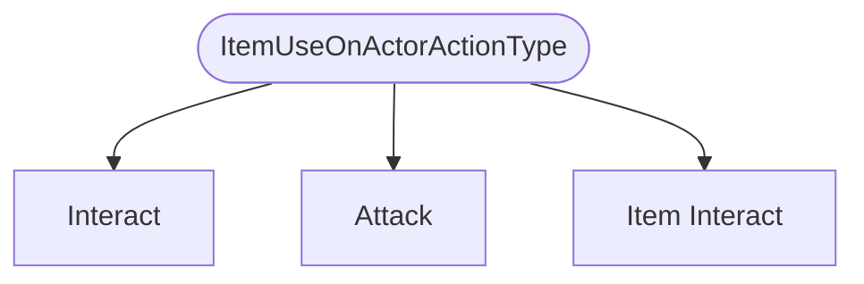

# ItemUseOnActorActionType

`enum` - wire `int32`

```mermaid
flowchart TB
  ROOT(["ItemUseOnActorActionType"])
  ROOT --> Interact["Interact"]
  ROOT --> Attack["Attack"]
  ROOT --> Item_Interact["Item Interact"]
```

