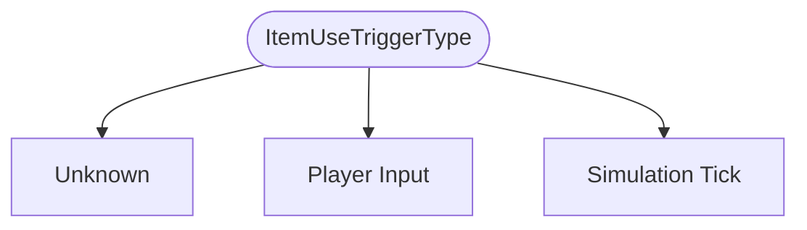

# ItemUseTriggerType

`enum` - wire `uint8`

```mermaid
flowchart TB
  ROOT(["ItemUseTriggerType"])
  ROOT --> Unknown["Unknown"]
  ROOT --> Player_Input["Player Input"]
  ROOT --> Simulation_Tick["Simulation Tick"]
```

