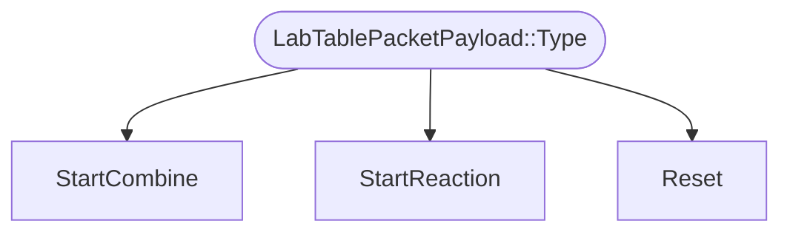

# LabTablePacketPayload::Type

`enum` - wire `uint8`

```mermaid
flowchart TB
  ROOT(["LabTablePacketPayload::Type"])
  ROOT --> StartCombine["StartCombine"]
  ROOT --> StartReaction["StartReaction"]
  ROOT --> Reset["Reset"]
```

