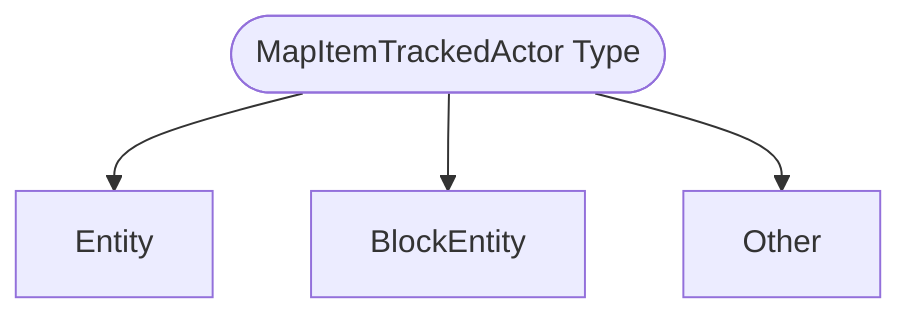

# MapItemTrackedActor Type

`enum` - wire `int32`

```mermaid
flowchart TB
  ROOT(["MapItemTrackedActor Type"])
  ROOT --> Entity["Entity"]
  ROOT --> BlockEntity["BlockEntity"]
  ROOT --> Other["Other"]
```

