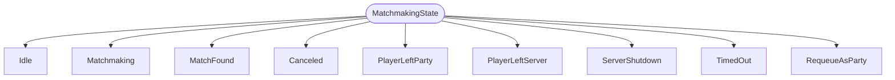

# MatchmakingState

`enum` - wire `uint8`

```mermaid
flowchart TB
  ROOT(["MatchmakingState"])
  ROOT --> Idle["Idle"]
  ROOT --> Matchmaking["Matchmaking"]
  ROOT --> MatchFound["MatchFound"]
  ROOT --> Canceled["Canceled"]
  ROOT --> PlayerLeftParty["PlayerLeftParty"]
  ROOT --> PlayerLeftServer["PlayerLeftServer"]
  ROOT --> ServerShutdown["ServerShutdown"]
  ROOT --> TimedOut["TimedOut"]
  ROOT --> RequeueAsParty["RequeueAsParty"]
```

